# Architecture

## Scope

This repository contains two cooperating workspaces:

- the root Next.js application (`app/`, `components/`, `lib/`)
- the maintainer-operated ingestion pipeline (`scraper/`)

The database is the normalized source of truth, but it is not part of the
production request path.

## System Overview

Academic data moves through four stages:

1. The scraper parses source PDFs and generates transactional SQL.
2. A maintainer imports the reviewed SQL into Supabase Postgres.
3. `npm run data:build` validates the database and exports versioned read
   snapshots under `data/snapshots/`.
4. Next.js pages and route handlers serve those immutable deployment snapshots.

Anonymous user timetable, planner, calculator, and settings state remains in
the browser. The application never writes user state to Postgres.

```mermaid
flowchart LR
    Sources["SUSS source PDFs and manifests"] --> Scraper["Local scraper"]
    Scraper --> SQL["Reviewed transactional SQL"]
    SQL --> DB["Supabase Postgres source of truth"]
    DB --> Generator["npm run data:build"]
    Generator --> Snapshots["Split JSON read snapshots"]
    Snapshots --> Next["Next.js pages and APIs"]
    Next --> Browser["Anonymous browser client"]
    Browser <--> Local["Browser localStorage"]
```

## Database Contract

Snapshot generation reads these existing relations without changing them:

- `courses`
- `semesters`
- `semester_weeks`
- `academic_calendar_events`
- `academic_calendar_event_semesters`
- `classes`
- `class_events`
- `assessment_components`

No new table or migration is required for the snapshot architecture.
`lib/db/schema.ts` remains the Drizzle mapping used by the build-time exporter
and database tooling.

## Snapshot Contract

Generated files are deliberately split by access pattern:

- `manifest.json`: format version, timestamps, coverage, semesters, weeks,
  calendar events, and shard paths
- `course-index.json`: compact searchable course records and offering metadata
- `courses/<bucket>.json`: full details, assessments, and offered semesters for
  one deterministic course-code bucket
- `schedules/<semesterId>-<bucket>.json`: classes and dated events for one
  semester and course-code bucket

`data/snapshots/` is generated and gitignored. A production build regenerates
it before `next build`; the snapshot reader keeps filesystem paths specific
enough for Next.js to trace only the snapshot categories used by each server
entry.

The snapshot format is versioned by `DATA_SNAPSHOT_FORMAT_VERSION` in
`lib/data/snapshot-types.ts`. Runtime readers reject an incompatible format.

## Runtime Data Access

Primary files:

- `lib/data/*-reader.ts` and `lib/data/snapshot-cache.ts`: safe, category-specific,
  memoized JSON file access
- `lib/data/metadata.ts`: semesters, weeks, calendar, coverage, update timestamp
- `lib/data/course-search.ts`: course search, calculator search, and facets
- `lib/data/course-details.ts`: course details, assessments, classes, and counts
- `lib/data/timetable.ts`: semantic selection resolution and timetable assembly
- `lib/data/queries.ts`: compatibility export surface used by pages and APIs

Runtime code does not import `postgres`, Drizzle, or `DATABASE_URL`. A cold
request may read deployment files, but it cannot query the database.

## Publication and Caching

Every deployment contains one internally consistent snapshot. Static snapshot
files are immutable for that deployment. JSON API responses use a one-year
shared-cache lifetime; Vercel deployments provide the cache boundary, so a new
deployment publishes a new data version atomically.

After importing new academic data, trigger a new production deployment. No
runtime cache-revalidation endpoint or cache secret is required.

## Routing and User State

- `/timetable` restores semantic class identifiers from `localStorage` and
  resolves them against snapshot shards.
- `/courses` searches the generated course index.
- `/courses/[courseCode]` combines a course-detail shard with optional schedule
  shards.
- `/share` resolves URL-contained semantic identifiers without storing them on
  the server.
- `/api/export/ics` and `/api/export/pdf` assemble exports from the same
  snapshots.

Class links use `course_code + schedule_type + group_code_type + group_code`,
not database surrogate IDs, so refreshed snapshots can resolve existing links
after database reimports.

For the complete publication workflow, deployment configuration, validation,
and rollback procedure, see [`docs/DataSnapshots.md`](./docs/DataSnapshots.md).
