# SUSSPlanner Developer Guide

This guide is an onboarding reference for developers working on SUSSPlanner. It
describes the architecture and workflows that are verifiable in this repository.
Where the intended production process is not represented in code, it is called
out under [Assumptions / Gaps](#assumptions--gaps).

## Project Overview

SUSSPlanner is a student-built academic planning platform with three main
anonymous-user capabilities:

1. Build a semester timetable from SUSS course class groups, inspect clashes,
   switch between class and exam views, and export the result.
2. Search the course catalog and inspect course details, class schedules, and
   assessment components.
3. Build a multi-semester study plan using catalog courses or manually entered
   courses.

Normal users do not have accounts. Timetable and study-plan state are stored in
browser `localStorage`. A timetable can be shared through a semantic URL that
contains a semester ID and selected class identifiers. The shared page remains
read-only until the recipient explicitly imports it into their local timetable.

The repository contains two cooperating workspaces:

- **Web application:** the root Next.js application in `app/`, `components/`,
  and `lib/`.
- **Data ingestion pipeline:** the local Node.js, TypeScript, and Python scraper
  in `scraper/`, which produces SQL for import into Postgres.

The web application reads academic data from Postgres. It does not write user
planner state or academic data to the database.

## System Architecture

### System Architecture Diagram

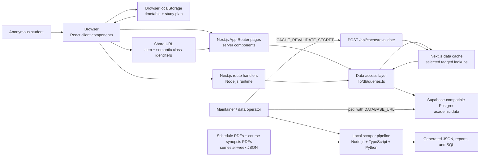

### Runtime Boundaries

| Boundary | Responsibilities | Key files |
|---|---|---|
| Browser | Interactive timetable, course search UI, study planner, `localStorage`, rendered PNG/PDF export | `components/`, `lib/timetable/local-storage.ts`, `lib/planner/storage.ts`, `lib/export/png.ts`, `lib/export/pdf-client.ts` |
| Next.js server | Server-rendered pages, validation, API route handlers, server-side ICS/PDF endpoints | `app/`, `lib/validation/`, `lib/export/ics.ts`, `lib/export/pdf.ts` |
| Data access layer | Centralized Drizzle queries, timetable assembly, clash detection, cached lookups | `lib/db/queries.ts`, `lib/db/index.ts`, `lib/timetable/clash-detection.ts` |
| Postgres | Source of truth for academic catalog, semester, class, event, and assessment data | `scraper/schema.sql`, mirrored by `lib/db/schema.ts` |
| Local scraper | Extracts source PDFs, creates review artifacts, and generates transactional SQL | `scraper/src/`, `scraper/tools/` |

### Architectural Rules Visible in the Code

- UI components do not query Postgres directly; database access is centralized
  in `lib/db/queries.ts`.
- `DATABASE_URL` is read by the server-side database client, Drizzle tooling,
  and the setup validator; maintainers also pass it to `psql`.
- Anonymous user state is not persisted server-side.
- Share URLs use semantic class identifiers instead of database `class_id`
  values, making links independent of raw surrogate IDs.
- The application runtime is read-only with respect to academic tables.
- Data updates happen outside the deployed app through generated SQL and
  `psql`.
- Selected semester/week/facet lookup queries use Next.js `unstable_cache` with a ten-minute
  revalidation period and cache tags.

## Tech Stack

### Web Application

| Area | Technology |
|---|---|
| Framework | Next.js 16 App Router |
| UI | React 19, TypeScript |
| Styling | Tailwind CSS 4 through PostCSS, plus CSS variables in `app/globals.css` |
| Database access | Drizzle ORM 0.44 and `postgres` driver |
| Database | Supabase-compatible PostgreSQL |
| Validation | Zod 4 |
| Server PDF generation | `pdf-lib` |
| Browser image/PDF export | `html-to-image` and `pdf-lib` |
| Icons | `react-icons` |
| Hosting configuration | Vercel, Singapore region (`sin1`) |

### Scraper

| Area | Technology |
|---|---|
| Main runtime | Node.js with TypeScript executed by `tsx` |
| Schedule/course parsing | TypeScript parsers in `scraper/src/parsers/` |
| PDF extraction helpers | Python 3 with `pdfplumber` |
| Review/import artifacts | JSON, TSV, CSV, and generated SQL |
| Database import | `psql` |

### Supported Tool Versions

The root `package.json` declares:

- Node.js `>=20`
- npm `>=10`

The setup validator rejects Node.js below 20 but only warns for npm below 10.
The scraper README recommends Node.js 18+, Python 3.10+, and `psql`.

## Repository Structure

```text
.
├── app/                         Next.js pages and API route handlers
│   ├── api/                     JSON, export, and cache-revalidation routes
│   ├── courses/                 Course search and detail pages
│   ├── planner/                 Multi-semester study-plan page
│   ├── share/                   Read-only shared timetable page
│   └── timetable/               Interactive timetable page
├── components/
│   ├── courses/                 Course search/detail client components
│   ├── layout/                  Shared application shell and navigation
│   ├── planner/                 Study-plan UI and shared icons
│   ├── timetable/               Timetable, exam, selection, and share UI
│   └── ui/                      Reusable actions and modal
├── lib/
│   ├── db/                      Drizzle client, schema mirror, and queries
│   ├── export/                  ICS, server PDF, browser PNG/PDF helpers
│   ├── planner/                 Study-plan types and local persistence
│   ├── timetable/               Domain types, URL encoding, storage, utilities
│   └── validation/              Zod schemas
├── drizzle/                     Intentionally empty migration-output directory
├── scraper/
│   ├── data/input/              Tracked source manifests and source PDFs
│   ├── src/cli/                 Scraper command entry points
│   ├── src/parsers/             Schedule and course-detail parsers
│   ├── src/sql/                 SQL generation
│   ├── tools/                   Python PDF extraction helpers
│   └── schema.sql               Complete database DDL used by scraper setup
├── scripts/validate-project.mjs Environment and toolchain validation
├── ARCHITECTURE.md              Existing shorter architecture summary
├── README.md                    Project overview and quick reference
├── drizzle.config.ts            Drizzle Kit configuration
├── next.config.js               Allowed development origins
└── vercel.json                  Vercel region configuration
```

`frontend/react/` currently contains only a `.gitignore` and is not part of the
application runtime.

## Setup Instructions

### Web Application Setup

1. Install Node.js 20+ and npm 10+.
2. Install root dependencies:

   ```bash
   npm install
   ```

3. Create local environment configuration:

   ```bash
   cp .env.example .env.local
   ```

4. Set a valid `DATABASE_URL` for a Postgres database containing the
   expected schema and data.
5. Validate setup:

   ```bash
   npm run validate:setup
   ```

6. Start the development server:

   ```bash
   npm run dev
   ```

7. Open `http://localhost:3000`.

`npm run dev`, `npm run build`, and `npm run start` automatically run their
corresponding validation scripts first.

### Scraper Setup

From `scraper/`:

```bash
npm install
python3 -m venv venv
source venv/bin/activate
pip install -r requirements.txt
```

The scraper needs `psql` only when importing generated SQL or running database
checks. It needs network access when downloading current course synopsis PDFs.

### Verification Commands

No automated test suite is configured. Available checks are:

```bash
npm run typecheck
npm run build

cd scraper
npm run typecheck
```

### Development Commands

| Command | Purpose |
|---|---|
| `npm run validate:setup` | Validate first-run dependencies and local environment configuration. |
| `npm run validate:dev` | Run the validation used automatically before `npm run dev`. |
| `npm run validate:build` | Run the validation used automatically before `npm run build`. |
| `npm run validate:start` | Run the validation used automatically before `npm run start`. |
| `npm run dev` | Start the Next.js development server. |
| `npm run typecheck` | Run root TypeScript checks without emitting files. |
| `npm run build` | Create a production build. |
| `npm run start` | Run the production build locally. |
| `npm run db:generate` | Generate Drizzle migration files after an intentional schema change. |

The setup validator checks supported Node/npm versions, installed dependencies,
local environment files, and the shape of `DATABASE_URL`. It also warns about
missing optional Supabase public variables and the cache-revalidation secret.

The application assumes that the academic database schema already exists. Do
not run `drizzle-kit push` against a shared or production database unless the
schema change is intentional and reviewed.

## Environment Variables

The root `.env.example` defines the complete documented environment surface:

| Variable | Required | Used by | Notes |
|---|---:|---|---|
| `DATABASE_URL` | Yes for app runtime and database tooling | `lib/db/index.ts`, `drizzle.config.ts`, setup validator, maintainer `psql` commands | Must be a `postgres://` or `postgresql://` URL. Keep server-side and secret. |
| `CACHE_REVALIDATE_SECRET` | Required only to enable cache revalidation endpoint | `app/api/cache/revalidate/route.ts` | Accepted through `x-revalidate-secret` or `Authorization: Bearer ...`. |
| `NEXT_PUBLIC_SUPABASE_URL` | No | Setup validator only | Present for compatibility/future browser integrations; not used by runtime application code. |
| `NEXT_PUBLIC_SUPABASE_ANON_KEY` | No | Setup validator only | Present for compatibility/future browser integrations; not used by runtime application code. |
| `NEXT_ALLOWED_DEV_ORIGINS` | No | `next.config.js`, setup validator | Comma-separated extra hostnames or HTTP(S) origins allowed during development. |

Never commit `.env.local` or real credentials. `.gitignore` excludes local
environment files except `.env.example`.

## Database and Schema

`scraper/schema.sql` is the most complete database definition in the repository.
`lib/db/schema.ts` manually mirrors the tables and read-only view for Drizzle
queries. The project does not maintain migrations for the existing academic
tables; `drizzle/README.md` says the migration directory is intentionally empty.

### Entity Relationship Diagram

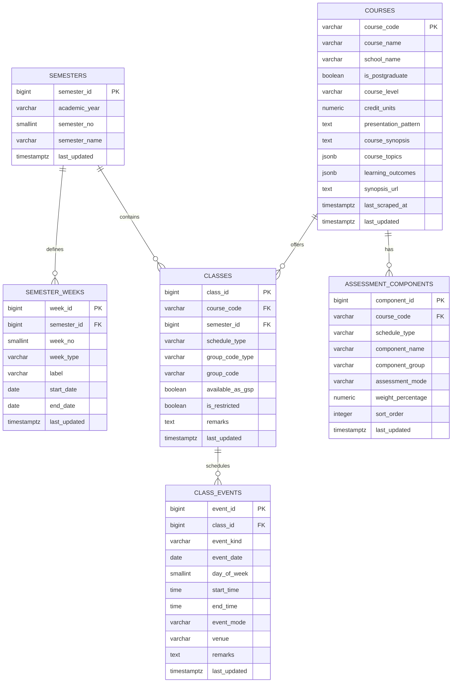

### Read-Only View

`v_class_events_with_week` joins `class_events` to `classes` and left-joins
`semester_weeks` when an event date falls within a semester-week date range.
Most class/timetable query paths read this view so events already carry course,
class-group, semester, and optional week information.

### Important Constraints

- `semesters` is unique by `(academic_year, semester_no)`.
- `semester_weeks` is unique by semester/week number, label, and date range.
- `classes` is unique by
  `(course_code, semester_id, schedule_type, group_code_type, group_code)`.
- `class_events` is unique by
  `(class_id, event_kind, event_date, start_time, end_time)`.
- `assessment_components` is unique by
  `(course_code, schedule_type, sort_order)`.
- `schedule_type` is `daytime` or `evening`.
- `group_code_type` is `TG` or `CRN`.
- `event_kind` is `CLASS`, `EXAM`, or `OTHER`.
- `week_type` is `TEACHING`, `STUDY`, or `EXAM`.
- `assessment_components` is intentionally not semester-specific because the
  source synopsis endpoint exposes only the latest/current assessment strategy.

### Database Access Behavior

- `lib/db/index.ts` fails immediately when `DATABASE_URL` is missing.
- The `postgres` client uses `prepare: false`, up to 3 connections in
  production, and up to 10 in development.
- Development reuses the client through `globalThis` to reduce hot-reload
  connection churn.
- Timetable assembly resolves semantic identifiers to matching class IDs, loads
  events and semester data, derives ECA markers, detects clashes, and returns
  unresolved identifiers without silently removing them from the response.

## Frontend Routes and Pages

| Route | Rendering and behavior |
|---|---|
| `/` | Re-exports `/timetable`; force-dynamic. |
| `/timetable` | Server-loads semesters with classes/weeks, then `PlannerClient` restores local state and fetches timetable/course/class data interactively. |
| `/planner` | Server-loads semester metadata, then `StudyPlanClient` manages a browser-local multi-semester course plan. |
| `/courses` | Server-loads semesters, weeks, and search facets; `CourseSearchPage` performs debounced API search using filters. |
| `/courses/[courseCode]` | Server-loads course details, assessments, offered semesters, and optional selected-semester classes. Returns Next.js `notFound()` for an unknown course. |
| `/share?sem=...&classes=...` | Validates and resolves the shared timetable on the server, then renders a read-only `ShareClient` with explicit import. Missing or malformed parameters get explanatory UI. |

The shared `AppShell` provides navigation to Timetable, Courses, and Planner.
`/share` is not a primary navigation item and is reached through a share URL.

## API and Backend Routes

All route handlers explicitly use the Node.js runtime.

| Method and route | Inputs | Response / purpose |
|---|---|---|
| `GET /api/courses/search` | `q`; repeatable `semesterIds`/`semesterId`; repeatable `scheduleTypes`/`scheduleType`; presence flags `postgraduateOnly`, `availableAsGspOnly`, `writtenExamOnly`, `ecaOnly`; legacy `postgraduate=postgraduate`; repeatable `schools`/`school`; repeatable `courseLevels`/`courseLevel`; `limit` (1-100, default 25) | `{ courses: CourseSearchResult[] }`; searches code, name, school, and synopsis and returns class counts/offered semesters. |
| `GET /api/courses/[courseCode]` | Optional `semesterId`, optional `scheduleType` | `{ course, classes, assessmentComponents }`; returns `404` when the course is missing. |
| `GET /api/classes` | Mode A: `courseCode` plus optional `semesterId`/`sem` and `scheduleType` | `{ classes: CourseClassRecord[] }`; class groups and their events. |
| `GET /api/classes` | Mode B: share query `sem` plus optional comma-separated `classes` | `{ timetable: TimetableData }`; resolves selections, events, clashes, weeks, and unresolved selections. |
| `GET /api/classes/counts` | Required `semesterId`, comma-separated `courseCodes` | `{ counts }`; used to show whether selected courses have alternative class groups. |
| `GET /api/export/ics` | Required `sem`; optional `classes` list | Downloadable `text/calendar` attachment containing all resolved events in `Asia/Singapore` timezone. |
| `GET /api/export/pdf` | Required `sem`; optional `classes` list | Downloadable `application/pdf` event-list attachment with clash summary. The current timetable/share UI instead creates its PDF from a browser-rendered PNG. |
| `POST /api/cache/revalidate` | Secret header; JSON `{ tags?: string[], paths?: string[] }` | Revalidates known cache tags and optional paths. Defaults to all known tags when valid tags are absent. |

PNG export is intentionally browser-side so it can preserve the rendered
timetable view; there is no `/api/export/png` route.

### Share URL Contract

```text
/share?sem=<positive-semester-id>[&classes=<identifier>,<identifier>,...]
```

Each class identifier is:

```text
COURSECODE:scheduleType:groupCodeType:groupCode
```

Example:

```text
/share?sem=1&classes=ICT133:evening:TG:T01,ANL252:daytime:CRN:12345
```

Zod validation in `lib/validation/timetable.ts` enforces:

- Positive integer semester ID.
- Course code containing 3-20 uppercase alphanumeric characters.
- `daytime` or `evening` schedule type.
- `TG` or `CRN` group-code type.
- Group code with no `:` or `,`.
- At most 50 selected classes.

## Authentication and Authorization

### Anonymous Users

There is no user authentication or account model in the web application.
Anonymous users can access all pages and all read/export API routes. Their
timetable and study-plan data remains in their browser.

### Maintainer Controls

There is no admin page, admin session, role table, or login route in this
repository. The repository shows two operational access gates:

1. **Database update access:** a maintainer must possess a writable
   `DATABASE_URL` to import generated SQL with `psql`.
2. **Cache invalidation access:** `POST /api/cache/revalidate` requires an exact
   match with `CACHE_REVALIDATE_SECRET`, supplied through
   `x-revalidate-secret` or a Bearer authorization header.

The `NEXT_PUBLIC_SUPABASE_*` variables do not implement browser authentication
and are not used by runtime code.

### Use Case Diagram

Mermaid does not provide a dedicated UML use-case syntax, so this uses a
GitHub-renderable flowchart with actors and use cases.

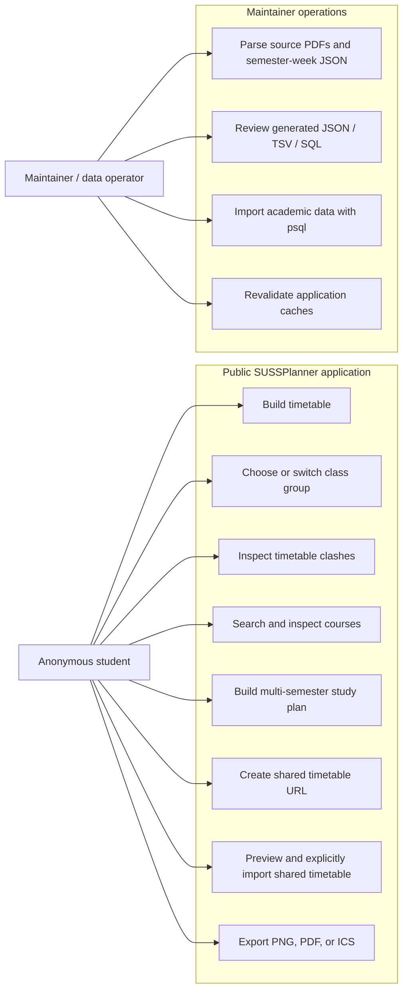

## Core User Flows

### Main User Flow Diagram

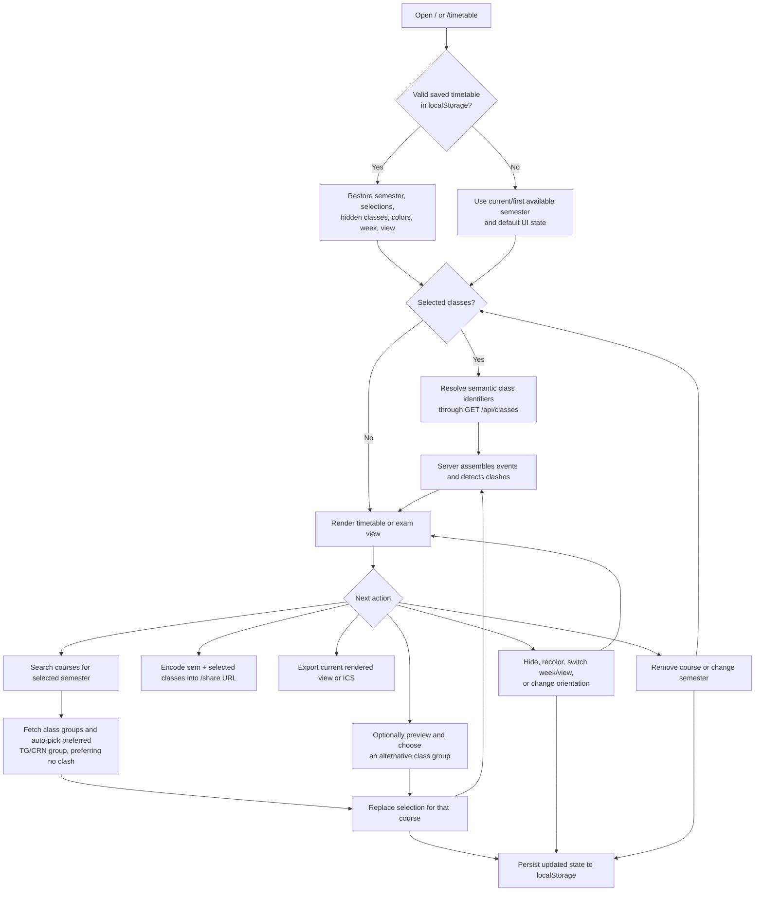

Changing semester does not clear saved selections; identifiers that do not exist
in the new semester are returned as `unresolvedSelections`.

### Study Plan Flow Diagram

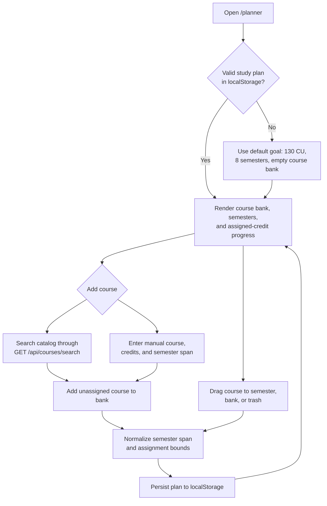

The study plan also listens for browser `storage` events and the local
`sussplanner:study-plan-updated` event used by course-page "Add to Planner"
buttons. Those buttons write directly to the same local-storage plan; the next
planner visit hydrates that saved plan.

### Admin Flow Diagram

The repository's "admin" flow is a local maintainer workflow, not an in-app
admin panel.

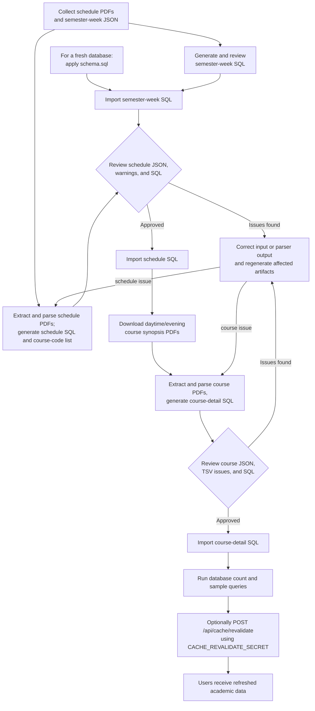

## Important State Models

### Timetable Persistence State

Storage key: `sussplanner.timetable.v1`

Persisted fields:

- `semesterId`
- `selectedClasses`
- `hiddenClasses`
- `courseColorsByCourseCode`
- `selectedWeekId`
- `orientation`
- `viewMode`

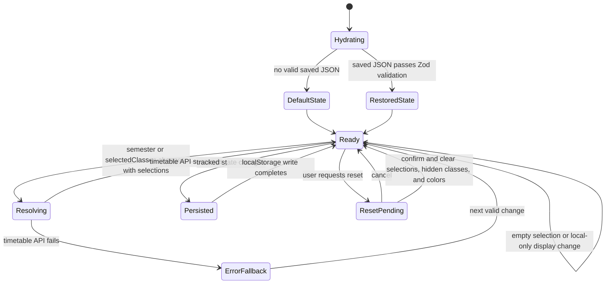

### Shared Timetable State

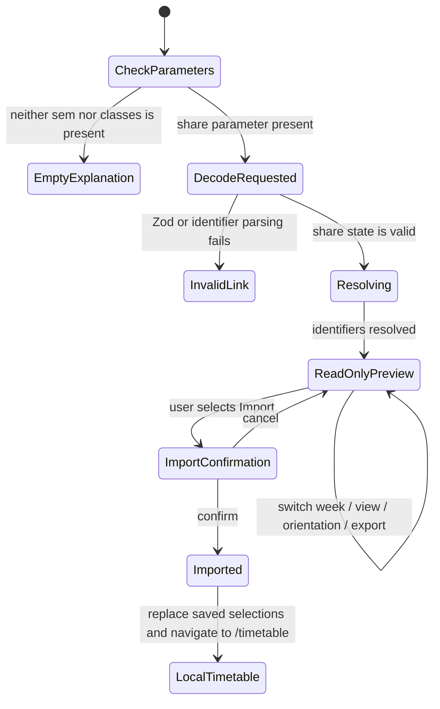

Importing a shared timetable:

- Replaces the locally saved semester and selected classes.
- Clears hidden classes.
- Resets selected week to `all`.
- Preserves existing course colors and orientation when available.
- Preserves the existing stored view mode, although the shared preview itself
  initially uses class view.

### Study Plan State

Storage key: `sussplanner.study-plan.v1`

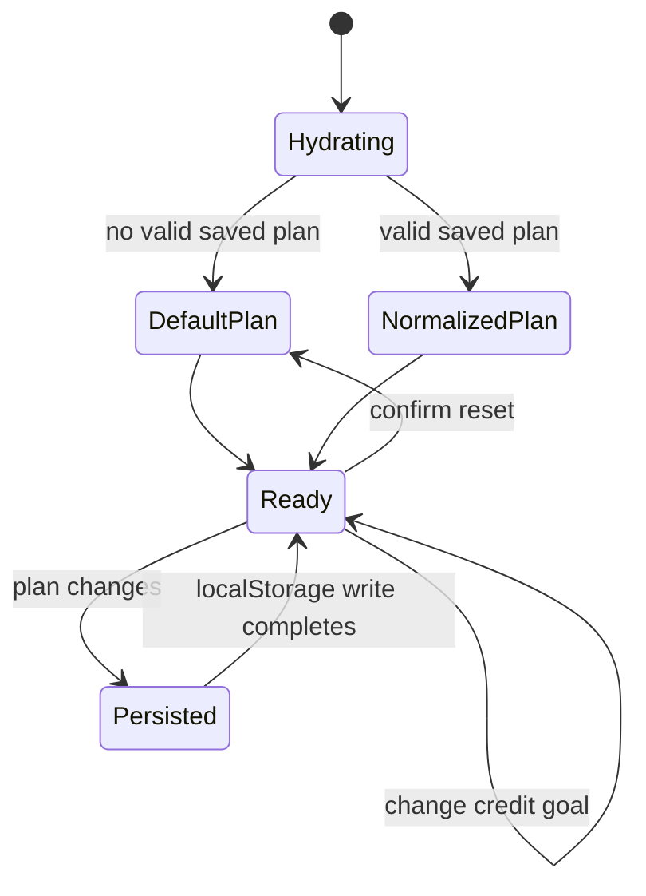

Study-plan normalization limits plans to 1-20 semesters and 300 courses.
Catalog courses normally span one semester; `NIE301`, `NIE351`, and course codes
ending in `499` are inferred to span two semesters.

## Key Sequence Diagrams

### Select a Course and Resolve a Timetable

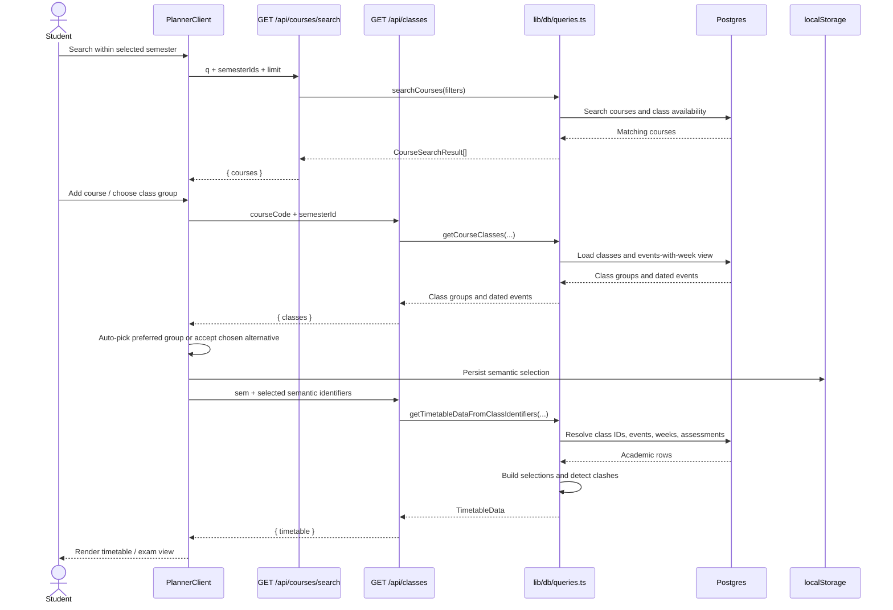

### Open and Import a Shared Timetable

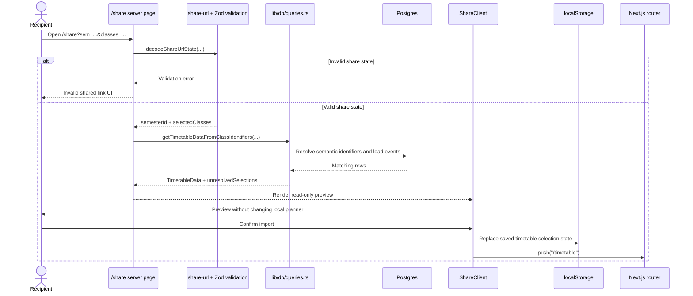

### Maintainer Data Refresh

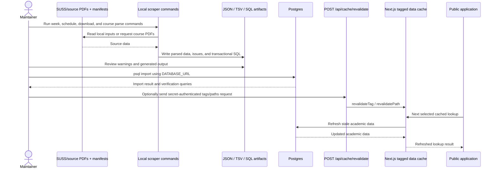

## Data Maintenance and Admin Flow

### Recommended Import Order

For a fresh database, `scraper/README.md` specifies the first six steps below.
Cache revalidation is a separate application operation implemented by its route
handler.

1. Apply `scraper/schema.sql`.
2. Generate and import semester-week SQL.
3. Parse schedule PDFs and import schedule SQL.
4. Download course synopsis PDFs.
5. Parse course synopsis PDFs and import course-detail SQL.
6. Verify database counts/sample rows.
7. Optionally revalidate application caches for a prompt refresh.

Run scraper commands from `scraper/`. The key commands are
`generate:weeks`, `scrape:all`, `download:courses`, and `parse:courses`; import
the generated SQL with `psql "$DATABASE_URL" -v ON_ERROR_STOP=1 -f <file>`.
See `scraper/README.md` for exact arguments, review queries, and troubleshooting.

Generated scraper output and downloaded course PDFs are gitignored. Generated
SQL is wrapped in `BEGIN`/`COMMIT` by default.

### Cache Revalidation After Import

```bash
curl -X POST https://<deployment>/api/cache/revalidate \
  -H "x-revalidate-secret: $CACHE_REVALIDATE_SECRET" \
  -H "content-type: application/json" \
  -d '{"tags":["semesters","semester-weeks","classes","courses","assessments"],"paths":["/","/timetable","/planner","/courses"]}'
```

Use an empty JSON body (`{}`) to revalidate all known tags, or provide only the
`tags` and optional `paths` that should be invalidated.

Valid tags are:

- `semesters`
- `semester-weeks`
- `classes`
- `courses`
- `assessments`

## Caching

The application uses two cache layers visible in the repository:

1. **Next.js data cache:** selected lookup functions in `lib/db/queries.ts` use
   `unstable_cache` with a 600-second revalidation interval and cache tags.
2. **HTTP shared-cache headers:** API routes set `Cache-Control` and
   `Vercel-Cache-Tag` headers.

| Route group | Cache-Control |
|---|---|
| Course search | `s-maxage=300, stale-while-revalidate=3600` |
| Classes, class counts, course detail | `s-maxage=3600, stale-while-revalidate=86400` |

The cache-revalidation route can invalidate both known data tags and explicitly
provided paths. If no valid tags are supplied, it invalidates all known tags.

## Deployment Notes

- `vercel.json` pins the Vercel region to Singapore: `sin1`.
- The deployed application requires `DATABASE_URL`.
- Configure `CACHE_REVALIDATE_SECRET` if maintainers need on-demand refreshes.
- `NEXT_PUBLIC_SUPABASE_URL` and `NEXT_PUBLIC_SUPABASE_ANON_KEY` are currently
  optional and unused by runtime code.
- `/` and `/timetable` are force-dynamic. `/planner` is also force-dynamic.
- API route handlers require the Node.js runtime, not the Edge runtime.
- Database connection limits are intentionally small in production (`max: 3`).
- The scraper is designed to run on a maintainer's machine, not inside Vercel.
- Academic tables must already exist before database-backed requests can
  succeed.
- Do not use `drizzle-kit push` against a shared or production database unless a
  schema change is explicitly intended and reviewed.

## Common Development Tasks

| Task | Guidance |
|---|---|
| Run/check the app | Use `npm run dev`, `npm run typecheck`, and `npm run build`. |
| Change a query | Keep DB access in `lib/db/queries.ts`; update returned types and cache tags when dependencies change. |
| Change the schema | Update `scraper/schema.sql`, `lib/db/schema.ts`, and affected SQL generation together. `drizzle/` is not currently the schema source of truth. |
| Change a page | Put server loading in `app/`, interaction in client components, and browser-triggered DB reads behind route handlers. |
| Change share/local state | Update timetable types, Zod validation, URL encoding, local storage, planner, and share-page behavior together. Format changes can invalidate existing URLs/state. |
| Refresh academic data | Follow the maintainer flow above and `scraper/README.md`; review issue reports before import and optionally revalidate caches afterward. |

## Known Limitations

- There is no user account, cloud synchronization, or server-side backup of
  timetable/study-plan state.
- Clearing browser storage or changing browsers loses locally saved plans.
- Only timetable semester/selections are shareable. The multi-semester study
  plan has no share/import/export format in the repository.
- Share links are limited to 50 class identifiers and depend on those semantic
  identifiers continuing to exist in the selected semester.
- Shared links do not preserve hidden classes, custom colors, selected week,
  orientation, or view mode.
- Prompt academic-data refresh depends on maintainers running the local scraper,
  reviewing/importing generated artifacts, and revalidating caches.
- Assessment components represent the latest strategy by course and schedule
  type, not historical semester-specific assessments.
- The codebase has no configured automated test suite.
- The scraper relies on external PDF formats and includes warning/issue reports
  because extraction can be incomplete or malformed.
- No in-app admin interface exists.
- The server PDF endpoint produces an event-list PDF, while the current UI's PDF
  action creates a PDF from a browser screenshot of the rendered timetable.
- `getCurrentSemesterContext` falls back to the first returned semester/week
  when today's date is outside all configured semester-week ranges.

## Assumptions / Gaps

The following details cannot be verified from repository code:

- **Production admin identity/authentication:** the project context describes
  admin authentication for maintainers, but the repository contains no admin
  account model, sign-in route, middleware, or role checks. The only verifiable
  controls are possession of `DATABASE_URL` and `CACHE_REVALIDATE_SECRET`.
- **Credential provisioning and rotation:** there is no documented process for
  granting, rotating, or revoking maintainer database credentials or the cache
  secret.
- **Production database policy configuration:** `scraper/schema.sql` defines
  tables, indexes, triggers, and a security-invoker view, but repository code
  does not define Supabase Row Level Security policies or production network
  restrictions.
- **Automated deployment pipeline:** Vercel region configuration is present, but
  no CI/CD workflow files are tracked.
- **Scheduled scraper execution:** the scraper is documented and implemented as
  a local manual workflow; no cron job or hosted ingestion service exists here.
- **Monitoring, logging, backups, and incident response:** no repository-defined
  production operations process is present.
- **Source-data licensing and update cadence:** source PDF files and parsing
  logic are present, but the intended refresh frequency and distribution rules
  are not defined in code.
