# SUSSPlanner Developer Guide

This guide is an onboarding reference for developers working on SUSSPlanner. It
describes the architecture and workflows that are verifiable in this repository.
Where the intended production process is not represented in code, it is called
out under [Assumptions / Gaps](#assumptions--gaps).

## Project Overview

SUSSPlanner is a student-built academic planning platform with five main
anonymous-user capabilities:

1. Build a semester timetable from SUSS course class groups, inspect clashes,
   switch between class and exam views, and export the result.
2. Search the course catalog and inspect course details, class schedules, and
   assessment components.
3. Build a multi-semester course plan using catalog courses or manually entered
   courses, export/import a restorable JSON backup, and open an A4 print view
   for saving as PDF.
4. Calculate current and cumulative GPA from catalog or custom modules and
   compare current-semester Pass/Fail strategies.
5. Configure local appearance/timetable defaults and show in-app course
   registration reminders for bundled eCR and add-drop windows.

Normal users do not have accounts. Timetable, semester planner, GPA-calculator,
settings, and course-registration reminder interaction state are stored in
browser `localStorage`. Semester planners can additionally be backed up to and
restored from a local JSON file, or opened as an A4 print view for saving as
PDF. A timetable can be shared through a semantic URL that contains a semester
ID and selected class identifiers. The shared page remains read-only until the
recipient explicitly imports it into their local timetable.

The repository contains two cooperating workspaces:

- **Web application:** the root Next.js application in `app/`, `components/`,
  and `lib/`.
- **Data ingestion pipeline:** the local Node.js, TypeScript, and Python scraper
  in `scraper/`, which produces SQL for import into Postgres.

The web application reads academic data from Postgres. It does not write user
planner state or academic data to the database.

## System Architecture

### System Architecture Diagram

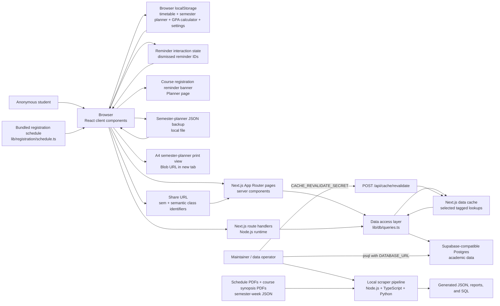

### Runtime Boundaries

| Boundary | Responsibilities | Key files |
|---|---|---|
| Browser | Interactive timetable, course search UI, semester planner, GPA calculator, settings, in-app registration reminders, `localStorage`, JSON plan backup/restore, rendered timetable PNG/PDF export, A4 semester-planner print view | `components/`, `lib/timetable/local-storage.ts`, `lib/planner/storage.ts`, `lib/settings/app-settings.ts`, `lib/registration/`, `components/calculator/gpa-calculator-client.tsx`, `lib/export/png.ts`, `lib/export/pdf-client.ts`, `lib/export/semester-planner-print.ts` |
| Next.js server | Server-rendered pages, validation, API route handlers, server-side ICS/PDF endpoints | `app/`, `lib/validation/`, `lib/export/ics.ts`, `lib/export/pdf.ts` |
| Data access layer | Centralized Drizzle queries, timetable assembly, clash detection, cached lookups | `lib/db/queries.ts`, `lib/db/index.ts`, `lib/timetable/clash-detection.ts` |
| Postgres | Source of truth for academic catalog, semester, class, event, and assessment data | `scraper/schema.sql`, mirrored by `lib/db/schema.ts` |
| Local scraper | Extracts source PDFs, creates review artifacts, and generates transactional SQL | `scraper/src/`, `scraper/tools/` |

### Architectural Rules Visible in the Code

- UI components do not query Postgres directly; database access is centralized
  in `lib/db/queries.ts`.
- `DATABASE_URL` is read by the server-side database client, Drizzle tooling,
  and the setup validator; maintainers also pass it to `psql`.
- Anonymous user state is not persisted server-side.
- App settings and course-registration reminder dismissals are local browser
  preferences; they are not persisted server-side.
- Share URLs use semantic class identifiers instead of database `class_id`
  values, making links independent of raw surrogate IDs.
- The application runtime is read-only with respect to academic tables.
- Data updates happen outside the deployed app through generated SQL and
  `psql`.
- Selected semester/week/facet lookup queries use Next.js `unstable_cache` with a ten-minute
  revalidation period and cache tags.

## Tech Stack

### Web Application

| Area | Technology |
|---|---|
| Framework | Next.js 16 App Router |
| UI | React 19, TypeScript |
| Styling | Tailwind CSS 4 through PostCSS, plus CSS variables in `app/globals.css` |
| Database access | Drizzle ORM 0.44 and `postgres` driver |
| Database | Supabase-compatible PostgreSQL |
| Validation | Zod 4 |
| Server PDF generation | `pdf-lib` |
| Browser image/PDF export | `html-to-image` and `pdf-lib` |
| Semester-planner backup and print export | Browser `Blob`/object URLs, native print dialog, and Zod validation |
| Settings and registration reminders | Browser `localStorage`, validated preference normalization, bundled registration-event data |
| Icons | `react-icons` |
| Hosting configuration | Vercel, Singapore region (`sin1`) |

### Scraper

| Area | Technology |
|---|---|
| Main runtime | Node.js with TypeScript executed by `tsx` |
| Schedule/course parsing | TypeScript parsers in `scraper/src/parsers/` |
| PDF extraction helpers | Python 3 with `pdfplumber` |
| Review/import artifacts | JSON, TSV, CSV, and generated SQL |
| Database import | `psql` |

### Supported Tool Versions

The root `package.json` declares:

- Node.js `>=20`
- npm `>=10`

The setup validator rejects Node.js below 20 but only warns for npm below 10.
The scraper README recommends Node.js 18+, Python 3.10+, and `psql`.

## Repository Structure

```text
.
├── app/                         Next.js pages and API route handlers
│   ├── api/                     JSON, export, and cache-revalidation routes
│   ├── calculators/             GPA and OCAS calculator page
│   ├── courses/                 Course search and detail pages
│   ├── planner/                 Multi-semester semester planner page
│   ├── share/                   Read-only shared timetable page
│   ├── settings/                Local app settings page
│   └── timetable/               Interactive timetable page
├── components/
│   ├── calculator/              GPA calculator client UI and browser-local state
│   ├── courses/                 Course search/detail client components
│   ├── layout/                  Shared application shell and navigation
│   ├── planner/                 Semester planner UI, add button, and shared icons
│   │   └── semester-planner/    Client, panel, drag/drop, and formatting helpers
│   ├── registration/            Course-registration reminder banner
│   ├── settings/                Settings UI and settings provider
│   ├── timetable/               Timetable, exam, selection, and share UI
│   └── ui/                      Reusable actions and modal
├── lib/
│   ├── db/                      Drizzle client, schema mirror, and queries
│   ├── export/                  ICS, server PDF, browser PNG/PDF, and semester-planner print helpers
│   ├── planner/                 Semester-planner types and local persistence
│   ├── registration/            Registration schedule, reminder timing, storage, validation, and tests
│   ├── settings/                App settings defaults, migration, storage, and update event helpers
│   ├── timetable/               Domain types, URL encoding, storage, utilities
│   └── validation/              Zod schemas
├── drizzle/                     Intentionally empty migration-output directory
├── scraper/
│   ├── data/input/              Tracked source manifests and source PDFs
│   ├── src/cli/                 Scraper command entry points
│   ├── src/parsers/             Schedule and course-detail parsers
│   ├── src/sql/                 SQL generation
│   ├── tools/                   Python PDF extraction helpers
│   └── schema.sql               Complete database DDL used by scraper setup
├── scripts/validate-project.mjs Environment and toolchain validation
├── ARCHITECTURE.md              Existing shorter architecture summary
├── README.md                    Project overview and quick reference
├── drizzle.config.ts            Drizzle Kit configuration
├── next.config.js               Allowed development origins
└── vercel.json                  Vercel region configuration
```

`frontend/react/` currently contains only a `.gitignore` and is not part of the
application runtime.

## Setup Instructions

### Web Application Setup

1. Install Node.js 20+ and npm 10+.
2. Install root dependencies:

   ```bash
   npm install
   ```

3. Create local environment configuration:

   ```bash
   cp .env.example .env.local
   ```

4. Set a valid `DATABASE_URL` for a Postgres database containing the
   expected schema and data.
5. Validate setup:

   ```bash
   npm run validate:setup
   ```

6. Start the development server:

   ```bash
   npm run dev
   ```

7. Open `http://localhost:3000`.

`npm run dev`, `npm run build`, and `npm run start` automatically run their
corresponding validation scripts first.

### Scraper Setup

From `scraper/`:

```bash
npm install
python3 -m venv venv
source venv/bin/activate
pip install -r requirements.txt
```

The scraper needs `psql` only when importing generated SQL or running database
checks. It needs network access when downloading current course synopsis PDFs.

### Verification Commands

The root app has a Vitest suite for registration reminders and settings
normalization, plus TypeScript and production-build checks:

```bash
npm test
npm test -- lib/registration/reminders.test.ts
npm run typecheck
npm run build

cd scraper
npm run typecheck
```

### Development Commands

| Command | Purpose |
|---|---|
| `npm run validate:setup` | Validate first-run dependencies and local environment configuration. |
| `npm run validate:dev` | Run the validation used automatically before `npm run dev`. |
| `npm run validate:build` | Run the validation used automatically before `npm run build`. |
| `npm run validate:start` | Run the validation used automatically before `npm run start`. |
| `npm run dev` | Start the Next.js development server. |
| `npm test` | Run the root Vitest suite. |
| `npm run typecheck` | Run root TypeScript checks without emitting files. |
| `npm run build` | Create a production build. |
| `npm run start` | Run the production build locally. |
| `npm run db:generate` | Generate Drizzle migration files after an intentional schema change. |

The setup validator checks supported Node/npm versions, installed dependencies,
local environment files, and the shape of `DATABASE_URL`. It also warns about
missing optional Supabase public variables and the cache-revalidation secret.

The application assumes that the academic database schema already exists. Do
not run `drizzle-kit push` against a shared or production database unless the
schema change is intentional and reviewed.

## Environment Variables

The root `.env.example` defines the complete documented environment surface:

| Variable | Required | Used by | Notes |
|---|---:|---|---|
| `DATABASE_URL` | Yes for app runtime and database tooling | `lib/db/index.ts`, `drizzle.config.ts`, setup validator, maintainer `psql` commands | Must be a `postgres://` or `postgresql://` URL. Keep server-side and secret. |
| `CACHE_REVALIDATE_SECRET` | Required only to enable cache revalidation endpoint | `app/api/cache/revalidate/route.ts` | Accepted through `x-revalidate-secret` or `Authorization: Bearer ...`. |
| `NEXT_PUBLIC_SUPABASE_URL` | No | Setup validator only | Present for compatibility/future browser integrations; not used by runtime application code. |
| `NEXT_PUBLIC_SUPABASE_ANON_KEY` | No | Setup validator only | Present for compatibility/future browser integrations; not used by runtime application code. |
| `NEXT_ALLOWED_DEV_ORIGINS` | No | `next.config.js`, setup validator | Comma-separated extra hostnames or HTTP(S) origins allowed during development. |

Never commit `.env.local` or real credentials. `.gitignore` excludes local
environment files except `.env.example`.

## Database and Schema

`scraper/schema.sql` is the most complete database definition in the repository.
`lib/db/schema.ts` manually mirrors the tables and read-only view for Drizzle
queries. The project does not maintain migrations for the existing academic
tables; `drizzle/README.md` says the migration directory is intentionally empty.

### Entity Relationship Diagram

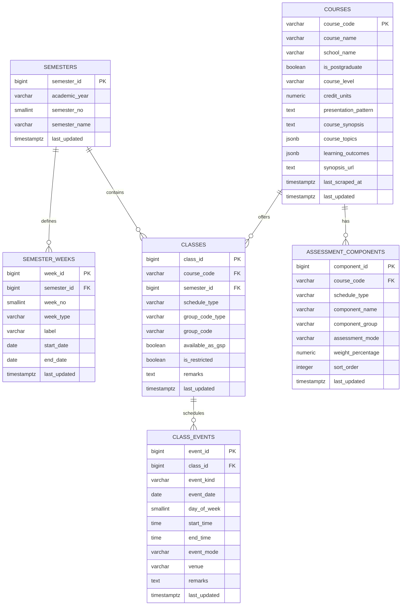

### Read-Only View

`v_class_events_with_week` joins `class_events` to `classes` and left-joins
`semester_weeks` when an event date falls within a semester-week date range.
Most class/timetable query paths read this view so events already carry course,
class-group, semester, and optional week information.

### Important Constraints

- `semesters` is unique by `(academic_year, semester_no)`.
- `semester_weeks` is unique by semester/week number, label, and date range.
- `classes` is unique by
  `(course_code, semester_id, schedule_type, group_code_type, group_code)`.
- `class_events` is unique by
  `(class_id, event_kind, event_date, start_time, end_time)`.
- `assessment_components` is unique by
  `(course_code, schedule_type, sort_order)`.
- `schedule_type` is `daytime` or `evening`.
- `group_code_type` is `TG` or `CRN`.
- `event_kind` is `CLASS`, `EXAM`, or `OTHER`.
- `week_type` is `TEACHING`, `STUDY`, or `EXAM`.
- `assessment_components` is intentionally not semester-specific because the
  source synopsis endpoint exposes only the latest/current assessment strategy.

### Database Access Behavior

- `lib/db/index.ts` fails immediately when `DATABASE_URL` is missing.
- The `postgres` client uses `prepare: false`, up to 3 connections in
  production, and up to 10 in development.
- Development reuses the client through `globalThis` to reduce hot-reload
  connection churn.
- Timetable assembly resolves semantic identifiers to matching class IDs, loads
  events and semester data, derives ECA markers, detects clashes, and returns
  unresolved identifiers without silently removing them from the response.

## Frontend Routes and Pages

| Route | Rendering and behavior |
|---|---|
| `/` | Static home page with links to Timetable, Courses, Planner, Calculators, and placeholder school portal shortcuts. |
| `/timetable` | Server-loads semesters with classes/weeks, then `PlannerClient` restores local state and fetches timetable/course/class data interactively. |
| `/planner` | Server-loads semester metadata, then `SemesterPlannerClient` manages a browser-local multi-semester course plan, JSON backup/restore, and A4 print/PDF view. |
| `/calculators` | Force-dynamic, `noindex` page. Server-loads semester/week metadata for `AppShell`; `GpaCalculatorClient` and `OcasCalculatorClient` manage browser-local GPA calculation and OCAS assessment simulation. |
| `/settings` | Server-loads semester/week metadata for `AppShell`, then `SettingsClient` manages browser-local colour-scheme, theme, timetable-orientation, and course-registration reminder preferences. |
| `/courses` | Server-loads semesters, weeks, and search facets; `CourseSearchPage` fetches the full catalog, caches it in memory for return navigation, refreshes stale cached data after 15 minutes, filters/searches the cached catalog client-side, and paginates results at 10 courses per page. |
| `/courses/[courseCode]` | Server-loads course details, assessments, offered semesters, and optional selected-semester classes. Returns Next.js `notFound()` for an unknown course. |
| `/share?sem=...&classes=...` | Validates and resolves the shared timetable on the server, then renders a read-only `ShareClient` with explicit import. Missing or malformed parameters get explanatory UI. |

The shared `AppShell` provides navigation to Home, Timetable, Courses, Planner,
Calculators, and Settings. `/share` is reached through a share URL.

## API and Backend Routes

All route handlers explicitly use the Node.js runtime.

| Method and route | Inputs | Response / purpose |
|---|---|---|
| `GET /api/courses/search` | `q`; repeatable `semesterIds`; repeatable `scheduleTypes`; presence flags `undergraduateOnly`, `postgraduateOnly`, `availableAsGspOnly`; repeatable `assessmentModes` (`TMA`, `GBA`, `Quiz`, `ECA`, `Written Exam`, `Proctored Online Exam`, `Online Exam`); repeatable `schools`; repeatable `courseLevels` | `{ courses: CourseSearchResult[] }`; searches code, name, school, and synopsis and returns class counts, offered semesters, and lightweight filter metadata. |
| `GET /api/calculator/courses` | `q` | `{ courses: { courseCode, courseName, creditUnits }[] }`; searches the complete course catalog by code or name without joining classes or filtering by semester presentation. Returns up to 8 ranked results. |
| `GET /api/courses/[courseCode]` | Optional `semesterId`, optional `scheduleType` | `{ course, classes, assessmentComponents }`; returns `404` when the course is missing. |
| `GET /api/classes` | Mode A: `courseCode` plus optional `semesterId`/`sem` and `scheduleType` | `{ classes: CourseClassRecord[] }`; class groups and their events. |
| `GET /api/classes` | Mode B: share query `sem` plus optional comma-separated `classes` | `{ timetable: TimetableData }`; resolves selections, events, clashes, weeks, and unresolved selections. |
| `GET /api/classes/counts` | Required `semesterId`, comma-separated `courseCodes` | `{ counts }`; used to show whether selected courses have alternative class groups. |
| `GET /api/export/ics` | Required `sem`; optional `classes` list | Downloadable `text/calendar` attachment containing all resolved events in `Asia/Singapore` timezone. |
| `GET /api/export/pdf` | Required `sem`; optional `classes` list | Downloadable `application/pdf` event-list attachment with clash summary. The current timetable/share UI instead creates its PDF from a browser-rendered PNG. |
| `POST /api/cache/revalidate` | Secret header; JSON `{ tags?: string[], paths?: string[] }` | Revalidates known cache tags and optional paths. Defaults to all known tags when `tags` is omitted; malformed JSON bodies or empty/invalid `tags` arrays return `400`. |

PNG export is intentionally browser-side so it can preserve the rendered
timetable view; there is no `/api/export/png` route.

Semester-planner JSON backup/import and the A4 print view are also browser-only.
There are no semester planner export/import/print API routes, and semester planner data is
not sent to the server during these flows.

GPA calculations are browser-side. The calculator search API is the only
calculator request and returns the minimum catalog fields needed by the UI.

### Share URL Contract

```text
/share?sem=<positive-semester-id>[&classes=<identifier>,<identifier>,...]
```

Each class identifier is:

```text
COURSECODE:scheduleType:groupCodeType:groupCode
```

Example:

```text
/share?sem=1&classes=ICT133:evening:TG:T01,ANL252:daytime:CRN:12345
```

Zod validation in `lib/validation/timetable.ts` enforces:

- Positive integer semester ID.
- Course code containing 3-20 uppercase alphanumeric characters.
- `daytime` or `evening` schedule type.
- `TG` or `CRN` group-code type.
- Group code with no `:` or `,`.
- At most 50 selected classes.

## Authentication and Authorization

### Anonymous Users

There is no user authentication or account model in the web application.
Anonymous users can access all pages and all read/export API routes. Their
timetable, semester planner, and GPA-calculator data remains in their browser.

### Maintainer Controls

There is no admin page, admin session, role table, or login route in this
repository. The repository shows two operational access gates:

1. **Database update access:** a maintainer must possess a writable
   `DATABASE_URL` to import generated SQL with `psql`.
2. **Cache invalidation access:** `POST /api/cache/revalidate` requires an exact
   match with `CACHE_REVALIDATE_SECRET`, supplied through
   `x-revalidate-secret` or a Bearer authorization header.

The `NEXT_PUBLIC_SUPABASE_*` variables do not implement browser authentication
and are not used by runtime code.

### Use Case Diagram

Mermaid does not provide a dedicated UML use-case syntax, so this uses a
GitHub-renderable flowchart with actors and use cases.

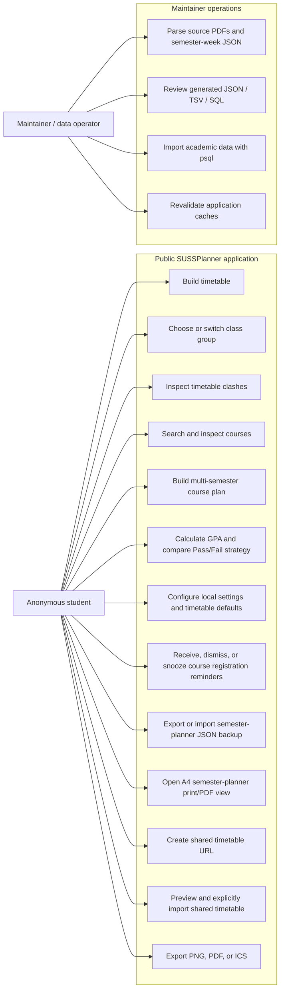

## Core User Flows

### Main User Flow Diagram

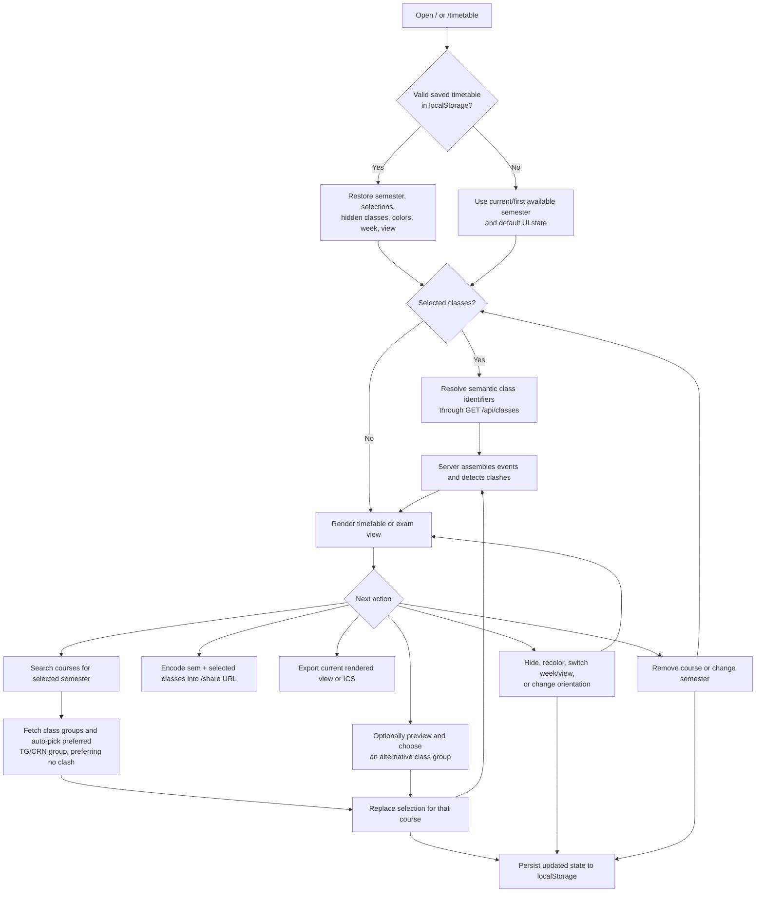

Changing semester loads the saved state for that semester, if one exists. Each
semester keeps its own selected classes, hidden classes, colors, and week
selection, so switching semesters does not leak timetable state between them.

### Semester Planner Flow Diagram

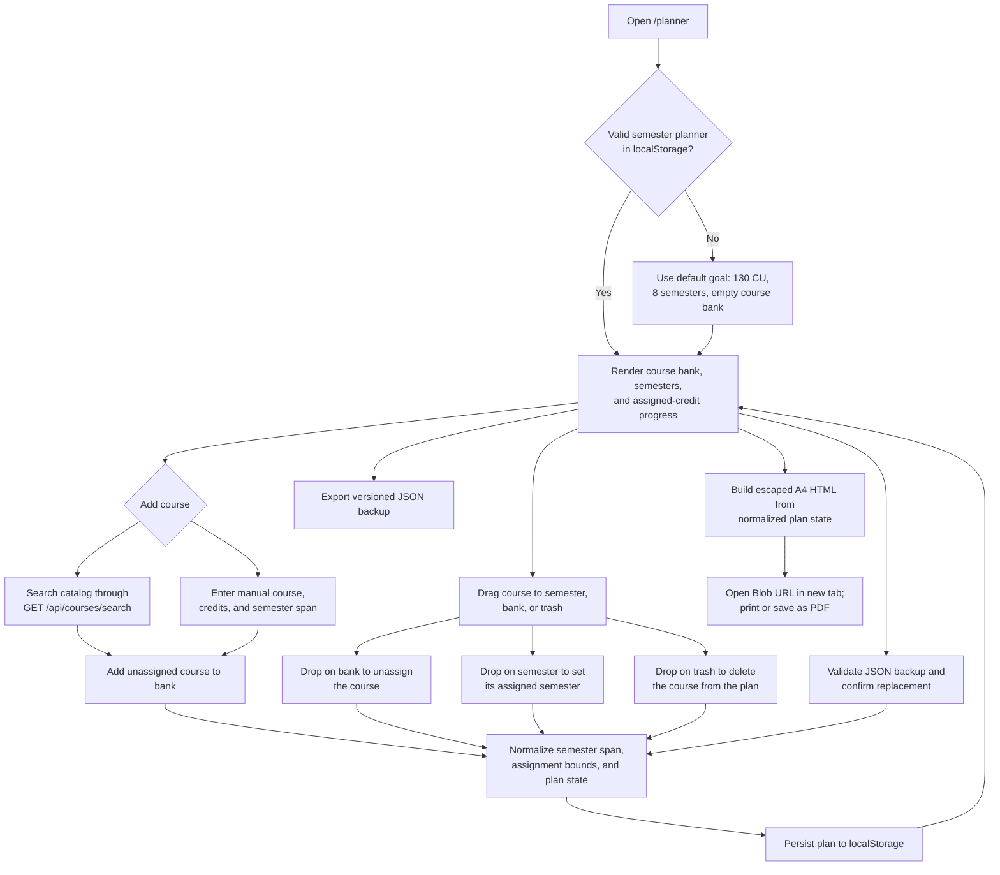

The semester planner also listens for browser `storage` events and the local
`sussplanner:semester-planner-updated` event used by course-page "Add to Planner"
buttons. Those buttons write directly to the same local-storage plan; the next
planner visit hydrates that saved plan.

The UI is split across `components/planner/semester-planner/`:

- `client.tsx` owns state, search, import/export handlers, modals, and semester
  rendering.
- `panel.tsx` renders the Module Bank and trash drop zone.
- `drag-drop.tsx` owns `@dnd-kit/core` drag/drop cards, droppables, overlay
  rendering, drop-target IDs, and drop-target parsing.
- `formatting.ts` contains feature-local display helpers such as CU formatting,
  semester option generation, offered-semester labels, and course sorting.

Course pages use `components/planner/add-to-semester-planner-button.tsx` to add
catalog courses directly into the same browser-local semester planner state.

Planner drag-and-drop is implemented with `@dnd-kit/core`. Dropping a course on
the Module Bank clears its assignment, dropping it on a semester assigns the
course to that semester, and dropping it on the trash deletes it. Invalid or
empty drops are treated as no-ops. Planner search, backup import, and saved-plan
load failures are logged to the browser console, while recoverable cases still
surface a user notice.

The planner header provides these data-protection and presentation actions:

- **Backup Plan** opens a menu containing the JSON **Export** and **Import**
  actions.
- **Export** serializes the current normalized plan into a versioned JSON backup
  and downloads it as
  `sussplanner-semester-plan-YYYY-MM-DD.json`.
- **Import** reads a local JSON file, rejects files larger than 1 MB, parses and
  validates the backup, and shows a module/semester summary before the user
  confirms replacement of the current plan.
- **Download PDF** uses the same normalized `SemesterPlannerState` as JSON export to
  create an escaped A4 HTML document. It opens the document through a temporary
  Blob URL in a new tab, where the user selects **Print / Save as PDF**.
- **Reset Planner** still requires confirmation and replaces the plan with the
  default state.

### Course Registration Reminder Flow Diagram

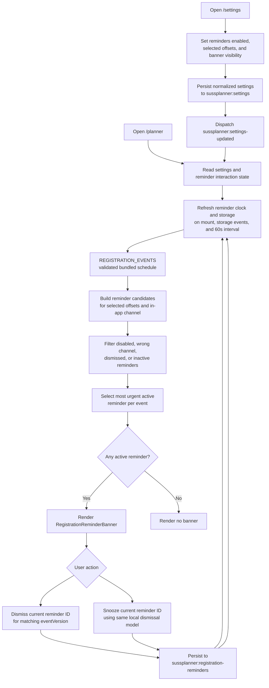

Registration reminders are intentionally in-app only today. The types and
reminder candidate builder can represent a `push` channel, but
`PUSH_REMINDERS_AVAILABLE` is `false` and settings normalization removes
push-only channel selections from user preferences.

The UI integration points are:

- `components/settings/settings-client.tsx` for reminder preference controls.
- `components/planner/semester-planner/client.tsx` for computing active
  reminders and handling dismiss/snooze.
- `components/registration/registration-reminder-banner.tsx` for the rendered
  Planner banner.
- `lib/registration/schedule.ts` for the bundled eCR/add-drop events.
- `lib/registration/reminders.ts` for candidate construction, active/due
  filtering, and most-urgent selection.
- `lib/registration/reminder-storage.ts` for local dismissal persistence and
  stale-record pruning.
- `lib/settings/app-settings.ts` for settings defaults, migration, and
  normalization.

### GPA Calculator Flow Diagram

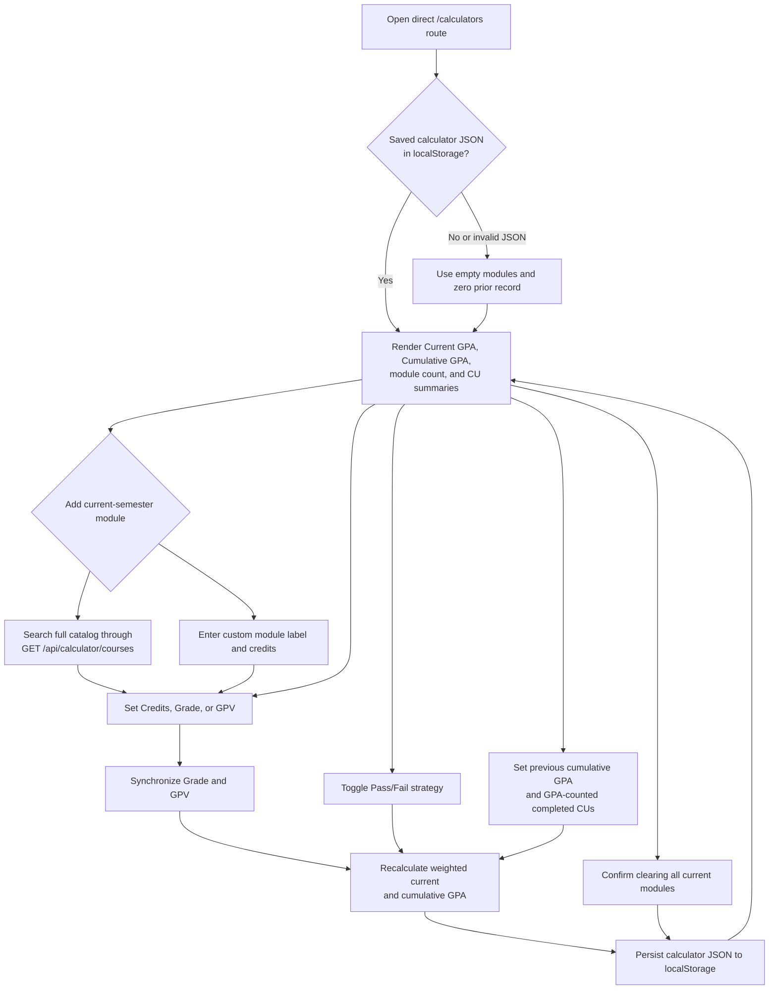

Calculator catalog search deliberately does not use class joins, offered
semesters, or current-semester filters. This lets users calculate GPA for any
course present in the `courses` table, including courses that are not currently
presented.

### Admin Flow Diagram

The repository's "admin" flow is a local maintainer workflow, not an in-app
admin panel.

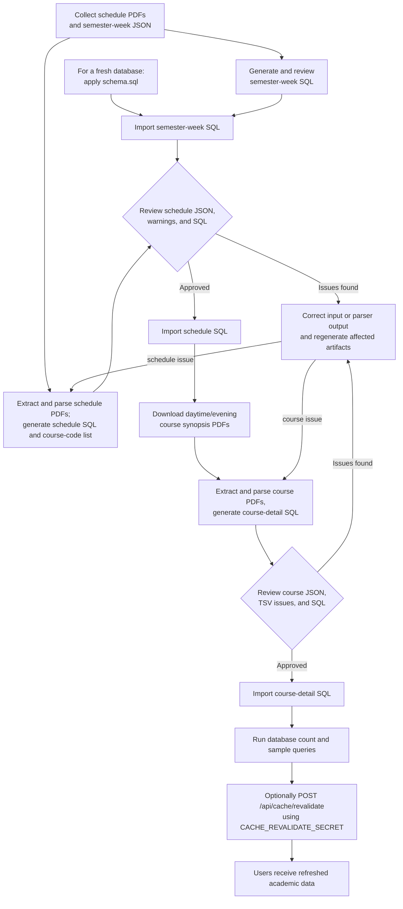

## Important State Models

### Timetable Persistence State

Storage key: `sussplanner.timetable.v1`

Persisted fields:

- `semesterId`
- `selectedClasses`
- `hiddenClasses`
- `courseColorsByCourseCode`
- `selectedWeekId`
- `orientation`
- `viewMode`
- `semesterStates`, a record of per-semester planner slices with the same
  fields as the active semester state

Related local keys and events:

- `sussplanner:timetable-updated` is the custom event used after timetable
  writes in this browser.
- `sussplanner.timetable.study-mode.v1` stores the global FT/PT study mode as
  `full-time` or `part-time`.
- `sussplanner:timetable-study-mode-updated` is dispatched after study-mode
  changes so mounted timetable controls can refresh without a page reload.
- `sussplanner.timetable-alerts.info-dismissal.v1` stores the signature for the
  currently dismissed informational timetable alert. It is component-local to
  `components/timetable/timetable-alerts.tsx` and is cleared when the relevant
  exceptional-class/event signature changes.

The active semester state is mirrored at the top level for compatibility. Each
semester keeps its own timetable selection, hidden block list, colors, and week
selection. Switching semesters loads the matching slice; reset clears only the
current semester slice.

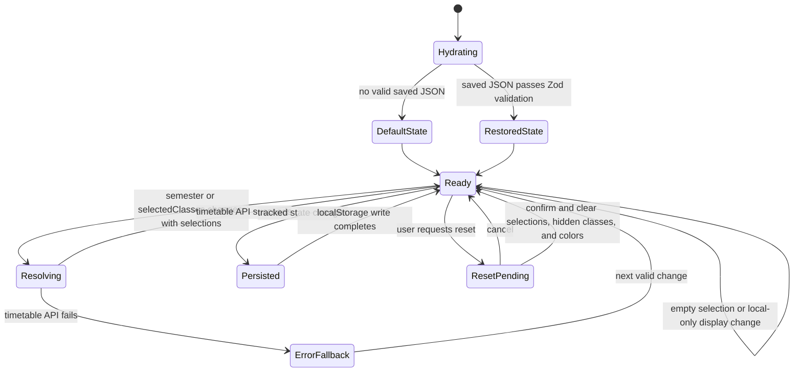

### Shared Timetable State

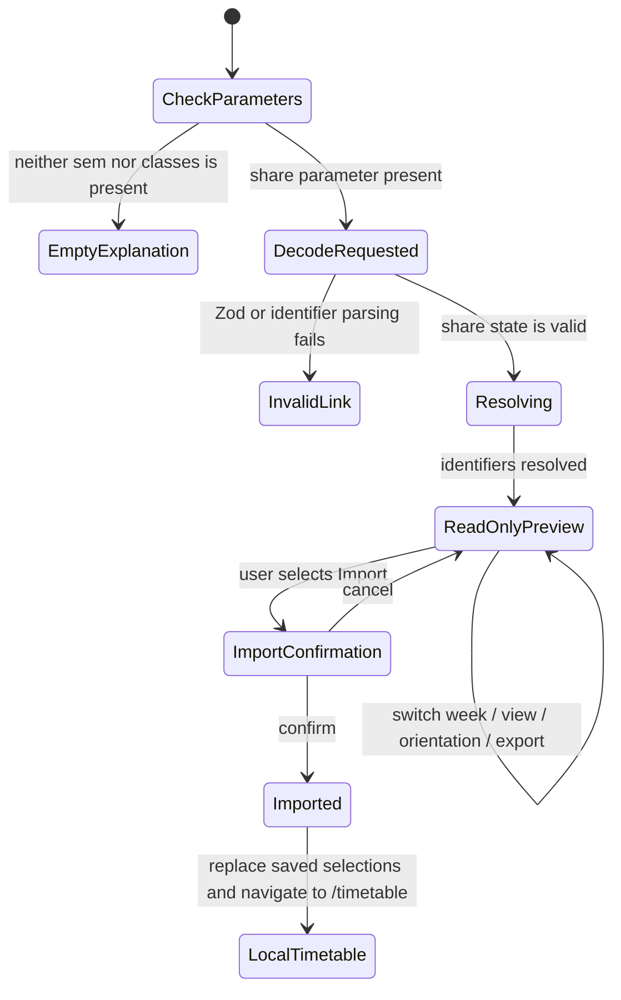

Importing a shared timetable:

- Replaces the saved state for the shared semester only.
- Clears hidden classes.
- Resets selected week to `all`.
- Preserves existing course colors and orientation when available.
- Preserves the existing stored view mode, although the shared preview itself
  initially uses class view.
- Leaves other saved semesters untouched.

Resetting the timetable clears only the selected semester state. It does not
touch other saved semesters.

### App Settings State

Storage key: `sussplanner:settings`

Persisted fields:

- `colorScheme`: `system`, `light`, or `dark`
- `themeId`
- `timetableOrientation`: `horizontal` or `vertical`
- `registrationReminders`

`registrationReminders` contains:

- `enabled`
- `offsetMinutes`
- `channels`
- `inAppBannerEnabled`
- `push`, currently normalized to disabled values because push reminders are
  not available

`lib/settings/app-settings.ts` normalizes legacy boolean reminder settings,
deduplicates supported reminder offsets and channels, removes unavailable push
channels, and dispatches `sussplanner:settings-updated` after saves. The
`SettingsProvider` listens for that event and browser `storage` events to apply
the resolved light/dark colour scheme to the document root.

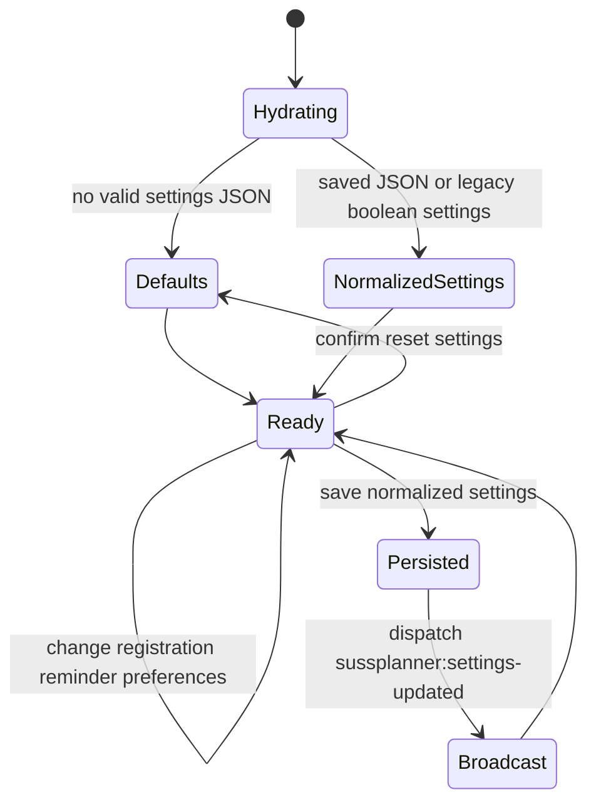

### Course Registration Reminder State

Reminder interaction storage key: `sussplanner:registration-reminders`

Persisted fields:

- `dismissedReminders`, keyed by reminder ID
- Per-dismissal `eventVersion`

Reminder IDs use:

```text
<registration-event-id>:<offsetMinutes>
```

Example:

```text
add-drop-2026-07:10080
```

`eventVersion` is either an explicit schedule version from
`lib/registration/schedule.ts` or a derived string from `startsAt`, `endsAt`,
and `sourceUpdatedAt`. This lets stale dismissals be ignored when the bundled
registration schedule changes.

Default in-app offsets are:

| Offset minutes | Label |
|---:|---|
| `10080` | 7 days before |
| `1440` | 1 day before |
| `0` | At opening time |

Current bundled registration events in `REGISTRATION_EVENTS` are:

| Event ID | Title | Starts | Ends | Schedule version |
|---|---|---|---|---|
| `ecr-2026-03` | eCR Period | `2026-03-17T00:00:00+08:00` | `2026-03-24T23:59:59+08:00` | `ecr-2026-03-v1` |
| `ecr-2026-10` | eCR Period | `2026-10-12T00:00:00+08:00` | `2026-10-23T23:59:59+08:00` | `ecr-2026-10-v1` |
| `add-drop-2026-07` | Add-Drop Period | `2026-07-17T00:00:00+08:00` | `2026-07-28T23:59:59+08:00` | `add-drop-2026-07-v1` |
| `add-drop-2026-12` | Add-Drop Period | `2026-12-18T00:00:00+08:00` | `2026-12-29T23:59:59+08:00` | `add-drop-2026-12-v1` |

The active reminder path uses these rules:

- Build candidates for valid events, selected offsets, and the in-app channel.
- Show a candidate only from `dueAt`/`visibleFrom` through the event `endsAt`.
- Hide candidates whose reminder ID has been dismissed for the same
  `eventVersion`.
- Return only the most urgent active reminder per event by default.
- Sort urgency by latest `dueAt`, then smaller absolute offset, then reminder
  ID.

Dismiss and snooze currently share the same storage behavior: hide the current
reminder ID for the matching event version. A later reminder ID for the same
event can still appear.

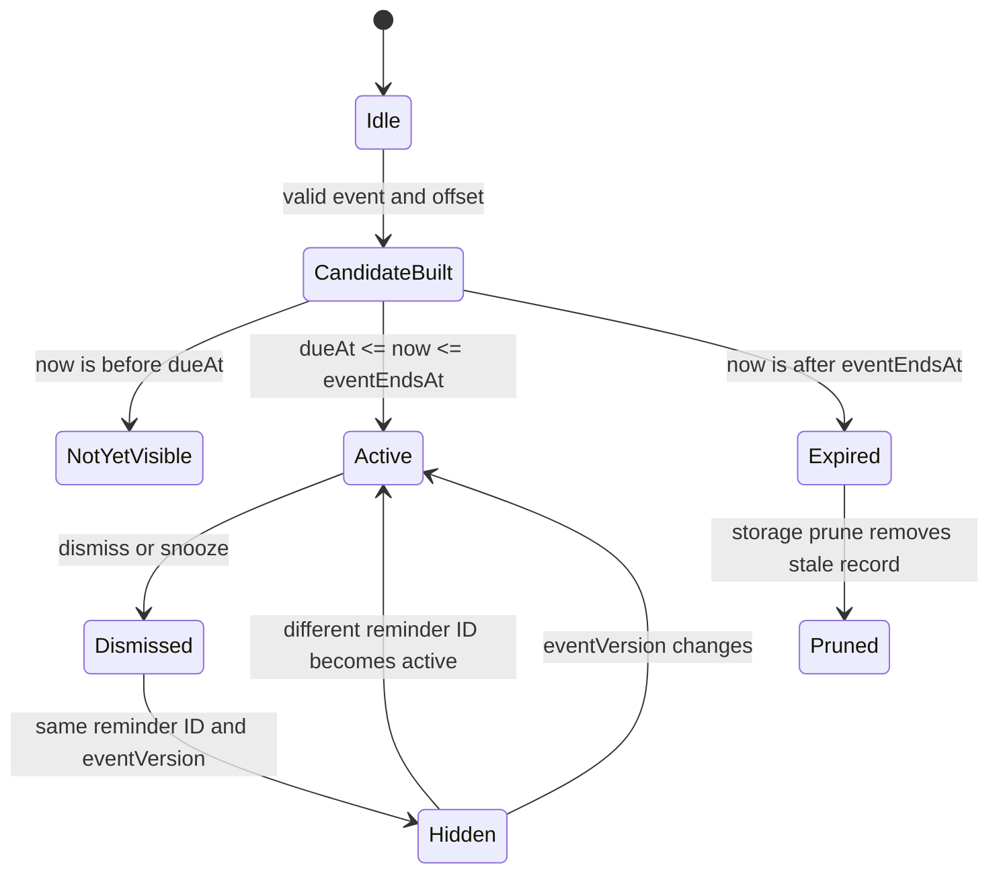

### Semester Planner State

Storage key: `sussplanner.semester-planner.v1`

Persisted fields:

- `totalCreditsGoal`
- `numSemesters`
- `courses`
- Per-course `id`, `courseCode`, `courseName`, `schoolName`, `creditUnits`,
  `semesterSpan`, `assignedSemester`, and `source`

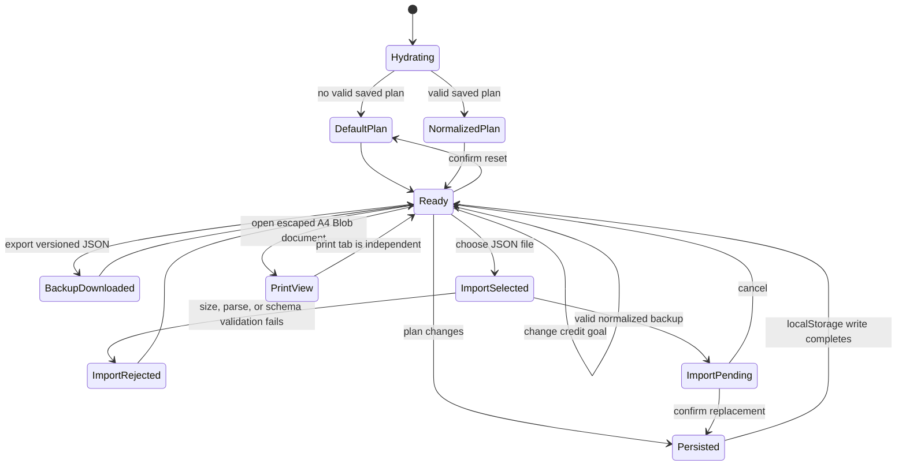

Semester-planner normalization limits plans to 1-20 semesters and 300 courses.
Catalog courses normally span one semester; `NIE301`, `NIE351`, and course codes
ending in `499` are inferred to span two semesters.

### GPA Calculator State and Formulas

Storage key: `sussplanner:gpa-calculator`

Persisted JSON fields:

- `modules`
- `priorGpa`
- `priorCredits`
- Per-module `courseCode`, `courseName`, `creditUnits`, `grade`, `gradePoint`,
  and `isPassFail`

The calculator is implemented directly in
`components/calculator/gpa-calculator-client.tsx`; it does not currently have a
separate type, validation, or storage module. Hydration catches malformed JSON
and starts clean when parsing fails. Every subsequent module/prior-record
change is written back to `localStorage`.

Grade and GPV are bidirectionally synchronized through the fixed SUSS scale.
Both `A+` and `A` map to `5.0`; selecting GPV `5.0` uses `A` as the canonical
displayed grade.

Pass/Fail modules remain in the current-semester module list and enrolled-CU
total, but are excluded from both GPA point totals and GPA-counted CU
denominators. Their Grade and GPV controls are disabled while Pass/Fail is
selected.

```text
currentGpaCredits = sum(module.creditUnits where !module.isPassFail)

currentGpa =
  sum(module.creditUnits * module.gradePoint where !module.isPassFail)
  / currentGpaCredits

cumulativeGpa =
  (priorGpa * priorCredits
    + sum(module.creditUnits * module.gradePoint where !module.isPassFail))
  / (priorCredits + currentGpaCredits)
```

Current GPA is empty when `currentGpaCredits` is zero. Cumulative GPA is empty
only when `priorCredits + currentGpaCredits` is zero. Users are instructed to
exclude historical Pass/Fail modules from `priorCredits`; the UI cannot verify
that input.

`Clear all` opens the shared `Modal` confirmation and removes only current
modules. It preserves `priorGpa` and `priorCredits`.

### Semester Planner Backup Contract

Semester planners can be exported and restored through this versioned JSON envelope:

```json
{
  "format": "sussplanner-semester-planner",
  "version": 1,
  "exportedAt": "2026-06-12T12:00:00.000Z",
  "plan": {
    "totalCreditsGoal": 130,
    "numSemesters": 8,
    "courses": []
  }
}
```

The backup format and parser live in `lib/planner/storage.ts`; the envelope and
plan schemas live in `lib/validation/planner.ts`. Import protection includes:

- A 1 MB file-size limit before reading the selected file.
- Required `sussplanner-semester-planner` format identifier and supported version
  literal.
- Zod validation of every course and top-level plan field.
- Limits of 1-20 semesters, at most 300 courses, bounded strings/numbers, and
  valid catalog/manual source values.
- Normalization of course codes, semester spans, and assignment bounds after
  parsing.
- Explicit user confirmation before the current plan is replaced.

Invalid or unsupported files show a notice and do not modify the current plan.

### Semester Planner Print/PDF View

`lib/export/semester-planner-print.ts` consumes the same normalized
`SemesterPlannerState` used by JSON export. It creates a browser-only HTML document
with:

- A4 `@page` print sizing and print-specific removal of preview chrome.
- Target credits, assigned credits, module count, and semester count.
- Planned modules grouped by semester, plus unassigned Module Bank courses.
- SUSSPlanner colors and compact summary cards designed to fit on one row.
- HTML escaping for user-entered or imported course codes, names, and school
  names before interpolation into the document.

The generated HTML is opened using a temporary Blob URL with `opener` cleared.
The object URL is revoked after 60 seconds. If the browser blocks the new tab,
the planner shows a notice asking the user to allow pop-ups.

## Key Sequence Diagrams

### Export, Import, or Print a Semester Planner

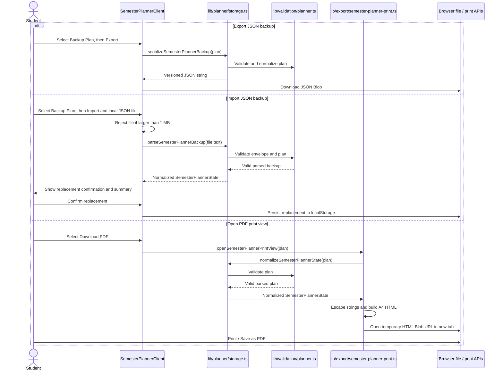

### Select a Course and Resolve a Timetable


### Open and Import a Shared Timetable

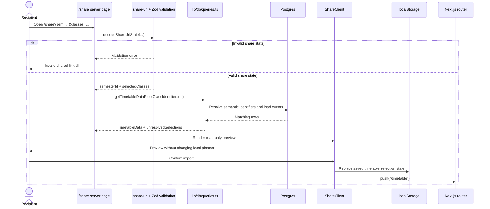

### Show and Dismiss a Registration Reminder

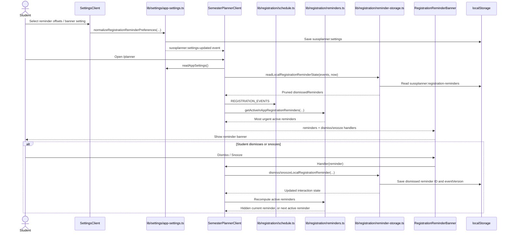

### Maintainer Data Refresh

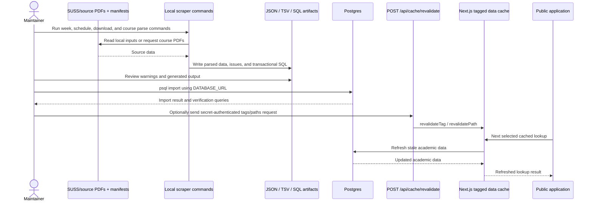

## Data Maintenance and Admin Flow

### Recommended Import Order

For a fresh database, `scraper/README.md` specifies the first six steps below.
Cache revalidation is a separate application operation implemented by its route
handler.

1. Apply `scraper/schema.sql`.
2. Generate and import semester-week SQL.
3. Parse schedule PDFs and import schedule SQL.
4. Download course synopsis PDFs.
5. Parse course synopsis PDFs and import course-detail SQL.
6. Verify database counts/sample rows.
7. Optionally revalidate application caches for a prompt refresh.

Run scraper commands from `scraper/`. The key commands are
`generate:weeks`, `scrape:all`, `download:courses`, and `parse:courses`; import
the generated SQL with `psql "$DATABASE_URL" -v ON_ERROR_STOP=1 -f <file>`.
See `scraper/README.md` for exact arguments, review queries, and troubleshooting.

Generated scraper output and downloaded course PDFs are gitignored. Generated
SQL is wrapped in `BEGIN`/`COMMIT` by default.

### Cache Revalidation After Import

```bash
curl -X POST https://<deployment>/api/cache/revalidate \
  -H "x-revalidate-secret: $CACHE_REVALIDATE_SECRET" \
  -H "content-type: application/json" \
  -d '{"tags":["semesters","semester-weeks","classes","courses","assessments"],"paths":["/","/timetable","/planner","/courses"]}'
```

Use an empty JSON object (`{}`), which omits `tags`, to revalidate all known
tags, or provide only the `tags` and optional `paths` that should be
invalidated.

Valid tags are:

- `semesters`
- `semester-weeks`
- `classes`
- `courses`
- `assessments`

## Caching

The application uses two cache layers visible in the repository:

1. **Next.js data cache:** selected lookup functions in `lib/db/queries.ts` use
   `unstable_cache` with a 600-second revalidation interval and cache tags.
2. **HTTP shared-cache headers:** API routes set `Cache-Control` and
   `Vercel-Cache-Tag` headers.

| Route group | Cache-Control |
|---|---|
| Course search | `s-maxage=300, stale-while-revalidate=3600` |
| Classes, class counts, course detail | `s-maxage=3600, stale-while-revalidate=86400` |

The cache-revalidation route can invalidate both known data tags and explicitly
provided paths. If `tags` is omitted, it invalidates all known tags. Malformed
JSON bodies or empty/invalid `tags` arrays return `400`. `GET /api/calculator/courses`
does not currently set shared-cache headers.

## Deployment Notes

- `vercel.json` pins the Vercel region to Singapore: `sin1`.
- The deployed application requires `DATABASE_URL`.
- Configure `CACHE_REVALIDATE_SECRET` if maintainers need on-demand refreshes.
- `NEXT_PUBLIC_SUPABASE_URL` and `NEXT_PUBLIC_SUPABASE_ANON_KEY` are currently
  optional and unused by runtime code.
- `/timetable`, `/planner`, and `/calculators` are force-dynamic.
- `/settings` uses the shared app shell's server-loaded semester context and
  applies browser-local preferences on the client.
- `/calculators` and `/settings` set `robots.index` and `robots.follow` to
  `false`.
- API route handlers require the Node.js runtime, not the Edge runtime.
- Database connection limits are intentionally small in production (`max: 3`).
- The scraper is designed to run on a maintainer's machine, not inside Vercel.
- Academic tables must already exist before database-backed requests can
  succeed.
- Do not use `drizzle-kit push` against a shared or production database unless a
  schema change is explicitly intended and reviewed.

## Common Development Tasks

| Task | Guidance |
|---|---|
| Run/check the app | Use `npm run dev`, `npm run typecheck`, and `npm run build`. |
| Change a query | Keep DB access in `lib/db/queries.ts`; update returned types and cache tags when dependencies change. |
| Change the schema | Update `scraper/schema.sql`, `lib/db/schema.ts`, and affected SQL generation together. `drizzle/` is not currently the schema source of truth. |
| Change a page | Put server loading in `app/`, interaction in client components, and browser-triggered DB reads behind route handlers. |
| Change share/local state | Update timetable types, Zod validation, URL encoding, local storage, planner, and share-page behavior together. Format changes can invalidate existing URLs/state. |
| Change GPA Calculator behavior | Update `components/calculator/gpa-calculator-client.tsx`; keep Grade/GPV synchronization, Pass/Fail denominators, and local-storage format aligned. |
| Change calculator catalog search | Keep the minimal response and full-catalog behavior in `app/api/calculator/courses/route.ts` and `searchCalculatorCourses` in `lib/db/queries.ts`; do not accidentally add semester/class filters. |
| Change semester-planner backup format | Update `lib/planner/storage.ts`, `lib/validation/planner.ts`, and this guide. Preserve support for existing public versions or reject them with a clear notice. |
| Change semester-planner print output | Update `lib/export/semester-planner-print.ts`; keep all interpolated user/imported strings escaped and verify both A4 preview and print styles. |
| Change app settings | Update `lib/settings/app-settings.ts`, `components/settings/settings-client.tsx`, `components/settings/settings-provider.tsx`, and tests that cover normalization/migration. |
| Change course registration reminders | Update `lib/registration/schedule.ts`, `lib/registration/reminders.ts`, `lib/registration/reminder-storage.ts`, `components/registration/registration-reminder-banner.tsx`, Planner integration, tests, and both guides. Verify timing boundaries around each changed event. |
| Refresh academic data | Follow the maintainer flow above and `scraper/README.md`; review issue reports before import and optionally revalidate caches afterward. |

## Known Limitations

- There is no user account, cloud synchronization, or server-side backup of
  timetable, semester planner, or GPA-calculator state.
- Clearing browser storage or changing browsers loses locally saved plans that
  were not exported as JSON backups.
- GPA-calculator state has no export, import, share, cloud backup, or formal
  Zod validation layer.
- `/calculators` is excluded from search-engine indexing.
- Calculator results depend on user-entered grades, prior GPA, prior
  GPA-counted CUs, and Pass/Fail selections; the app cannot verify them against
  official academic records or policy.
- Only timetable semester/selections are shareable. The multi-semester study
  plan can be imported/exported as JSON but cannot be shared through a URL.
- Semester-planner PDF output depends on the browser print dialog and may require
  users to allow the new print-view tab.
- Share links are limited to 50 class identifiers and depend on those semantic
  identifiers continuing to exist in the selected semester.
- Shared links do not preserve hidden classes, custom colors, selected week,
  orientation, or view mode.
- Prompt academic-data refresh depends on maintainers running the local scraper,
  reviewing/importing generated artifacts, and revalidating caches.
- Course registration reminders depend on the bundled static schedule in
  `lib/registration/schedule.ts`; they are not fetched from an official live
  registration feed.
- Reminder dismiss/snooze state is local-only and does not sync across browsers
  or devices.
- Browser push notifications are represented in the reminder types but are
  disabled by settings normalization and not exposed as a production feature.
- Assessment components represent the latest strategy by course and schedule
  type, not historical semester-specific assessments.
- The root automated test coverage is currently focused on registration
  reminders, reminder storage, settings normalization, and validation; broader
  UI flows still rely on typecheck/build and manual browser verification.
- The scraper relies on external PDF formats and includes warning/issue reports
  because extraction can be incomplete or malformed.
- No in-app admin interface exists.
- The server PDF endpoint produces a timetable event-list PDF, while the
  timetable UI creates a PDF from a browser screenshot. The semester-planner PDF
  action instead opens an A4 HTML print view for the browser to save as PDF.
- `getCurrentSemesterContext` falls back to the first returned semester/week
  when today's date is outside all configured semester-week ranges.

## Assumptions / Gaps

The following details cannot be verified from repository code:

- **Production admin identity/authentication:** the project context describes
  admin authentication for maintainers, but the repository contains no admin
  account model, sign-in route, middleware, or role checks. The only verifiable
  controls are possession of `DATABASE_URL` and `CACHE_REVALIDATE_SECRET`.
- **Credential provisioning and rotation:** there is no documented process for
  granting, rotating, or revoking maintainer database credentials or the cache
  secret.
- **Production database policy configuration:** `scraper/schema.sql` defines
  tables, indexes, triggers, and a security-invoker view, but repository code
  does not define Supabase Row Level Security policies or production network
  restrictions.
- **Automated deployment pipeline:** Vercel region configuration is present, but
  no CI/CD workflow files are tracked.
- **Scheduled scraper execution:** the scraper is documented and implemented as
  a local manual workflow; no cron job or hosted ingestion service exists here.
- **Monitoring, logging, backups, and incident response:** no repository-defined
  production operations process is present.
- **Source-data licensing and update cadence:** source PDF files and parsing
  logic are present, but the intended refresh frequency and distribution rules
  are not defined in code.
